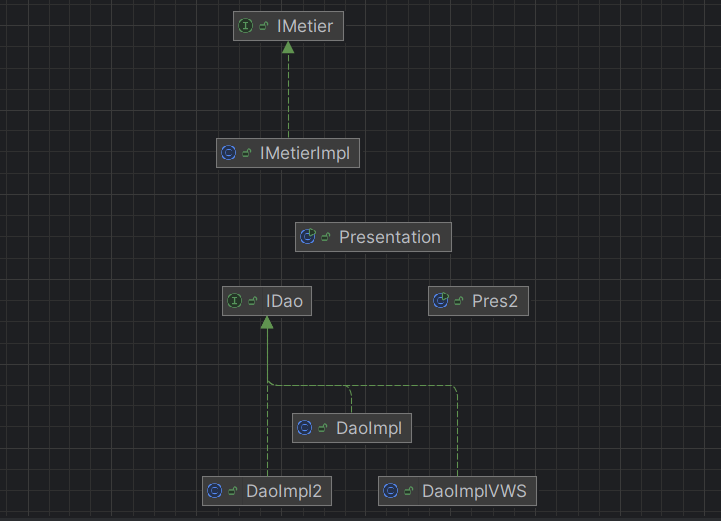

<h1 xmlns="http://www.w3.org/1999/html">Compte rendu du TP Injection des dépendances : 1ère partie</h1>
<h2>Diagramme de classe :</h2>

<h2>Exécution :</h2>

<h3>Injection des dépendances avec instanciation statique :</h3>
<h4>Version base de données</h4>

<h4>Version Capteurs</h4>

<h3>Injection des dépendances avec instanciation dynamique :</h3>
<h4>Version base de données</h4>

<h4>Version capteurs</h4>

<h4>Version WEB Service</h4>

